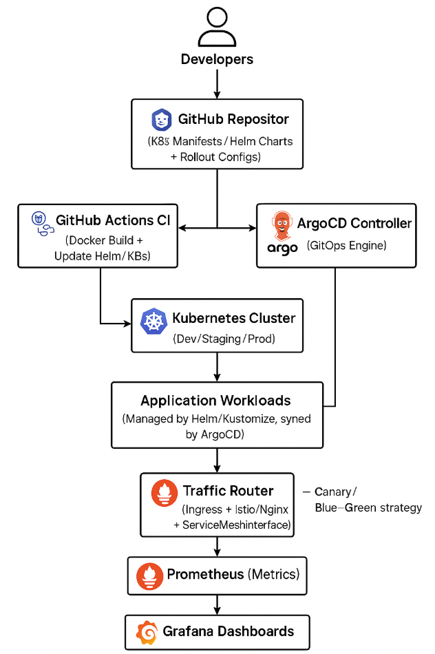

# GitOpsNavigator
# 🚀 Kubernetes GitOps Platform with Progressive Delivery

This project demonstrates a complete GitOps-based CI/CD pipeline using **ArgoCD**, **Kustomize**, **Helm**, **GitHub Actions**, **Prometheus**, and **Grafana**. It supports **canary** and **blue/green** deployment strategies using **Argo Rollouts**, along with automated rollback capabilities based on **Prometheus metrics**.

---

## 🧩 Tech Stack

- **ArgoCD** – GitOps controller to sync Kubernetes manifests from GitHub
- **Helm** – Package manager for Kubernetes apps
- **Kustomize** – Environment-specific configuration overlays
- **GitHub Actions** – CI/CD automation (build/test/push)
- **Prometheus** – Monitoring and metric collection
- **Grafana** – Metrics visualization and dashboards
- **Argo Rollouts** – Progressive delivery controller (Blue/Green & Canary strategies)

---

## 📁 Project Structure

```plaintext
manifests/
├── argocd/
│   ├── basic-application.yaml
│   ├── kustomize-application-dev.yaml
│   ├── kustomize-application-prod.yaml
│   └── kustomize-application-staging.yaml
├── gitops/
├── kustomize/
│   ├── base/
│   │   ├── deployment.yaml
│   │   ├── service.yaml
│   │   └── kustomization.yaml
│   └── overlays/
│       ├── dev/
│       │   ├── replicas-patch.yaml
│       │   └── kustomization.yaml
│       ├── staging/
│       │   ├── rollout-bluegreen.yaml
│       │   ├── service-rollout-active.yaml
│       │   ├── replicas-patch.yaml
│       │   └── kustomization.yaml
│       └── prod/
│           ├── rollout-canary.yaml
│           ├── service-rollout-canary.yaml
│           ├── service-monitor.yaml
│           ├── replicas-patch.yaml
│           ├── Canary-AnalysisTemplate.yaml
│           └── kustomization.yaml


```

## 🗺️ Architecture Diagram

This GitOps system works as follows:

1. Developers push code to GitHub.
2. GitHub Actions builds & tests the image, then pushes it to DockerHub.
3. ArgoCD syncs Kubernetes manifests (Kustomize overlays) and pulls the image.
4. Argo Rollouts handles deployment strategies per environment.
5. Prometheus tracks rollout metrics, enabling automatic rollback.
6. Grafana visualizes everything.

📷 **System Design Image**  
